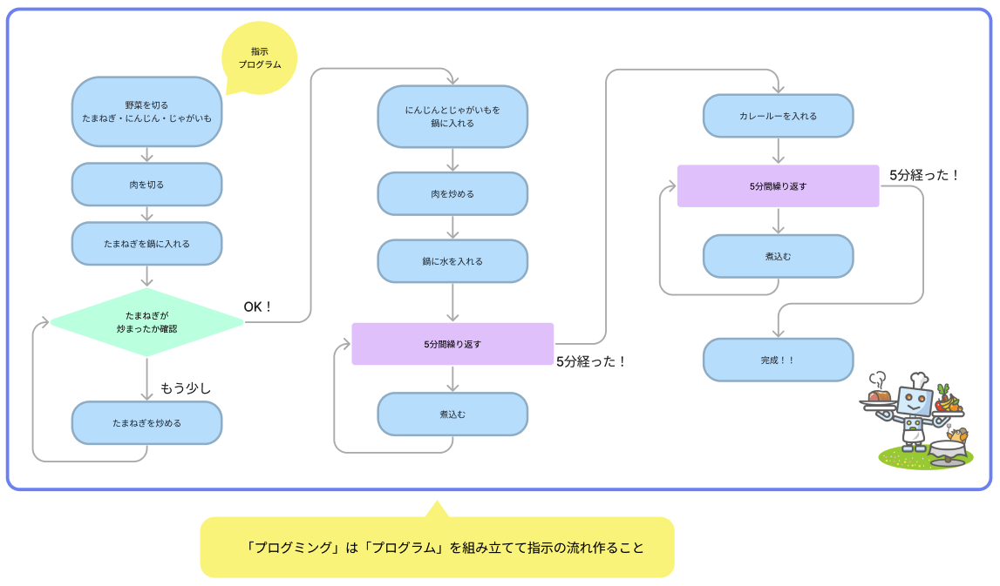
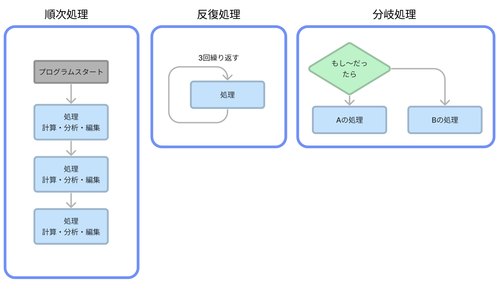

# **00_プログラミングとは**

## **「プログラム」と「プログラミング」** 

そもそもプログラミングってなんだろう？  

プログラミング・・・コンピュータにやってもらいたいことを順序立てて指示すること  

イメージしてみよう  
お料理ロボットがカレーを作るプログラムを考えてみよう！  
コンピュータにどんな指示を出すとよいだろう。

実際は、もっと細かく指示をする必要があります。  
プログラムを組み立てるための言語を「プログラミング言語」といいます。

## **基本の組み立て方**　

プログラミングの基本の処理は３つです。

### **順次処理**

手順に沿って順番に処理を進めること。プログラムは基本的に上から下に書いていくので、先に実行したい処理を上に書きます。

### **反復処理（繰り返し）**

処理を繰り返し実行すること。
「100回繰り返す」
「0になるまで繰り返す」

### **分岐処理**

条件によって実行する内容を変える