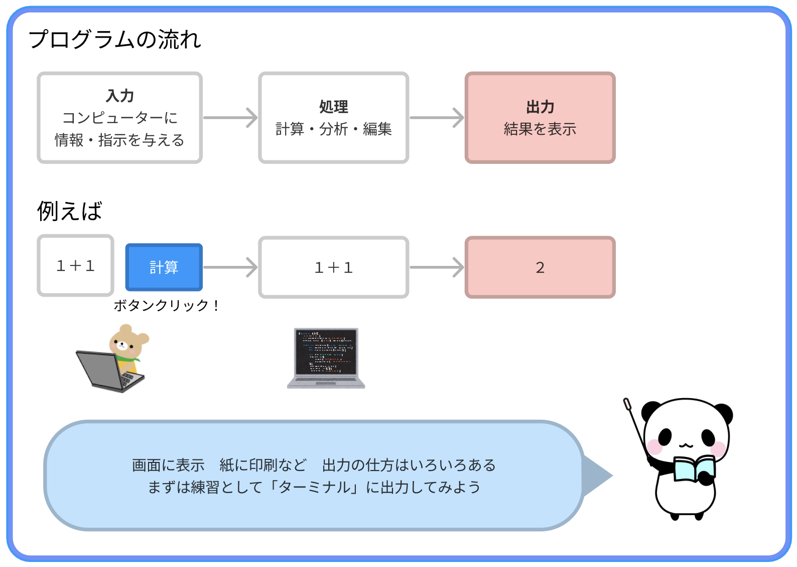

# **01_出力（Console.WriteLine）**

## **プログラムを実行してみよう！**



## **基本のコード**

必ず、次のコードを書いてあげよう  
※HTMLの `<html>` タグのようなもの

```dart
using System;
public class Program{
    public static void Main(){

    }
}
```

<br>

## **コメントアウト**

手前に「//」を入れると、記述を無効化できる  
<br>
**ショートカットキー**
- Windows：Ctrl + /
- Mac：Cmd + /

```dart
using System;
public class Program{
    public static void Main(){
      //ここにプログラムを書くよ
    }
}
```

<br>

## **文字の出力**

出力は `Console.WriteLine()` で行う  

```dart

    Console.WriteLine("Hello"); 

```

```
>> Hello
```

**ポイント**  
- 文字は `"` (ダブルクォーテーション)(Shift + 2 で出る)で囲う
- 最後に必ず `;` (セミコロン) を打つ
- 空白、改行、記号は、必ず見本に合わせる


<br>

## **数字の出力・計算**

```dart

  Console.WriteLine(1+2); 

```

```
>> 3
```

**ポイント**  
- **計算**したい**数字**などは、`'`をつけずに**そのまま書く**
- `+` ⇨ 足し算。例：1 + 2 >> 3
- `-` ⇨ 引き算。例：3 - 1 >> 2
- `*` ⇨ 掛け算。例：3 * 2 >> 6
- `/` ⇨ 割り算 小数点アリ。例：3 / 2 >> 1.5
- `~/`  ⇨ 割り算 小数点切り捨て。例：3 ~/ 2 >> 1
- `%` ⇨ 割り算をしたあまり。例：5 % 3 >> 2

<br>

# **練習課題（ショートカットキーを使おう）**

アプリ開発では頻繁にコピー、貼り付けを行います、ショートカットキーを使いましょう  
windowsは「Ctrl」キーを押しながら  
macは「command」キーを押しながら  

### **コピー＆ペースト**

Ctrl + C  
Ctrl + V

### **保存**

Ctrl + S

### **切り取り**

Ctrl + X

### **戻す**

Ctrl + Z

### **検索**

Ctrl + F

<br>

# **確認問題**

## **問題①**
`Console.WriteLine()`を使って、出力結果が次のようになるプログラムを書こう

```
>> こんにちは
```

<br>

## **問題②**
`Console.WriteLine()`を使って  
`2 * 3 + 4`  
と  
`2 * (3 + 4)`  
をプログラムでそれぞれ計算し、結果を出力しよう。  
どんな違いがあるかな？

<br>

## **問題③**

`Console.WriteLine()`を使って、出力結果が **5** になる計算プログラムを **3つ** 書こう  
例：`Console.WriteLine(5 + 0);`

```
>> 5
>> 5
>> 5
```

