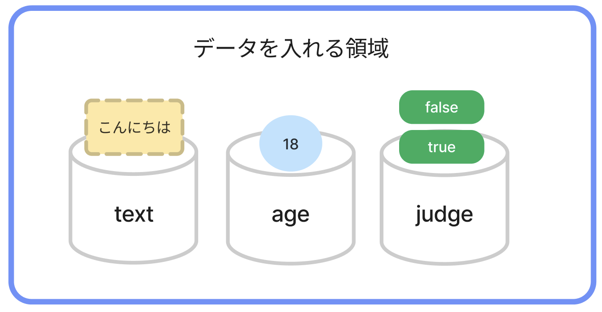
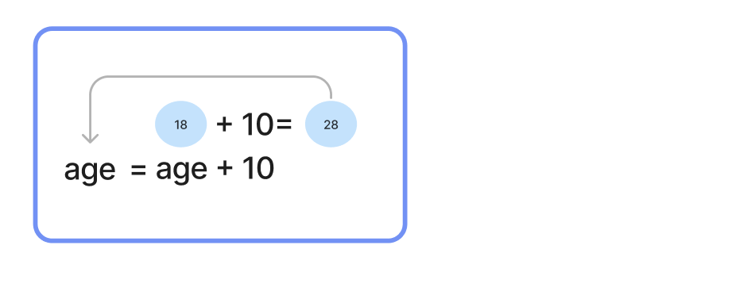
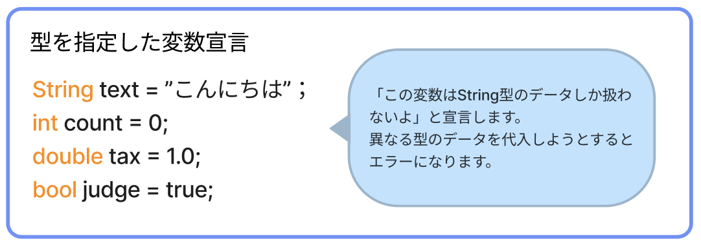

# **03_変数・定数（データを使おう）**




- **変数**：入れたデータを、後で**変えられる**  
- **定数**：入れたデータは、後で**変えられない**

`18` や `823800` などの、意味がわからないデータに  
**age**(年齢)は`18`  
**score**(点数)は`823800`  
と、名前をつけることができる

<br>

## **変数**

### **変数を作って、データを入れる**

`var 名前 = 入れたいデータ;`  

- **変数の宣言**：領域を展開すること `var`
- **変数の定義**：領域に名前をつけること `名前`
- **代入**：データを入れること `= 入れたいデータ`

```c#

  var age = 18;
  Console.WriteLine(age);

```

```
>> 18
```
<br>

### **変数に入ってるデータを、入れ替える**

**再代入** という

```dart

  var age = 18;

  // 変数は 値（データ）を 後から入れ替えられる！
  age = 19;
  Console.WriteLine(age);

```

```
>> 19
```

**ポイント**  
- `=` ⇦このイコールは **代入演算子** と呼ぶ
  - 1 + 2 = 3の比較に使う `=` とは違い、**右にある値を左に入れる** という、←的な意味がある
- **変数の名前**(変数名)は **半角英数字**(a - z, 0 - 9) でつける
  - 日本語はNG(HTMLのclass名を思い出そう)

<br>

### **計算した結果を、再代入する**

```dart

  var age = 18;

  age = age + 10;
  Console.WriteLine("10年後は"+ age + "歳です");
  Console.WriteLine($"10年後は{age}歳です");

```

```
>> 10年後は28歳です
```



### **再宣言できない**

```c#

  var age = 18;

  var age = 19;　←　エラーになります

  age = age + 10;
  Console.WriteLine("10年後は"+ age + "歳です");
  Console.WriteLine($"10年後は{age}歳です");

```

**補足**



<br>

# **確認問題**

## **問題①**
プログラムを書こう!!
- **name** という名前の **変数** を作り、自分の名前を代入
- 出力
```
>> (自分の名前が出力される)
```
<br>

## **問題②**
プログラムを書こう!!
- **level** という名前の **変数** をつくり **1** という整数を代入
- `level` を使い「レベル1」と出力
- **level** の値を **2** に変更(再代入)
- `level` を使い「レベルが2に上がった！」と出力
```
>> レベル1
>> レベルが2に上がった！
```
<br>

## **問題③**

このプログラムがエラーを出す理由は何だろう？

```dart

  var name = "トライ一郎";
  Console.WriteLine(namae); 

```

## **問題④**

このプログラムが結果通りに出力されない理由はなんだろう？

```dart

  var name = "トライ一郎";
  Console.WriteLine("nameさんこんにちは"); 

```

```
トライ一郎さんこんにちは
```

## **問題⑤**

num1かけるnum2の結果を出力しよう

```dart

  var num1 = 5;
  var num2 = 3;

```

```
15
```

## **問題⑥**

⑤のプログラムを修正して結果通りに出力しましょう  
num1,num2の値を変更しても正しい結果になること

```dart

  var num1 = 5;
  var num2 = 3;

```

```
5×3=15
```

## **問題⑦**

iをjで割った時のあまりを出力しよう

```dart

  var i = 100;
  var j = 3;

```

```
1
```

## **問題⑧**

1~100の中に7の倍数の数を出力しよう  
プログラムの続きを記述しよう

```dart

  var i = 100;
  var j = 7;

```

```
14
```

## **問題⑨**

このプログラムがエラーを出す理由は何だろう？  

```dart

  var name = "トライさん";
  var greet = こんにちは;

  Console.WriteLine(name + greet);

```

```
14
```

## **問題⑩**

このプログラムがエラーを出す理由は何だろう？

```dart

int num="18";
Console.WriteLine(num+10);

```