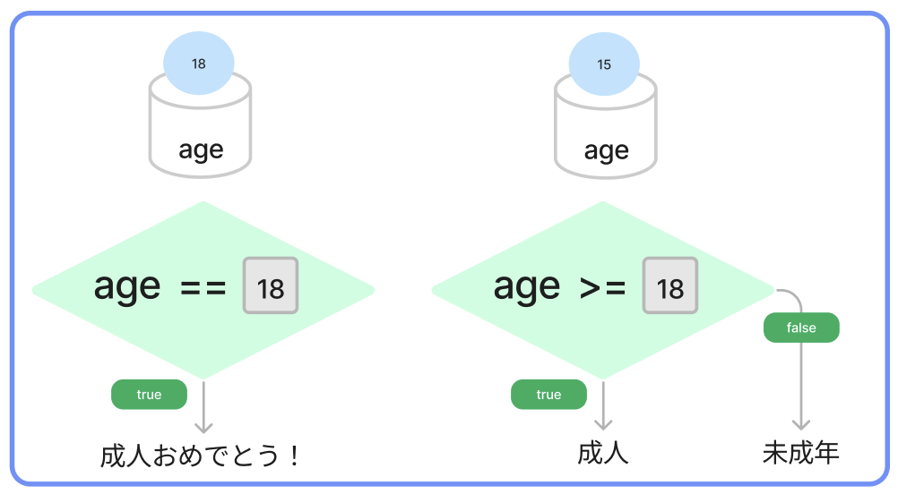
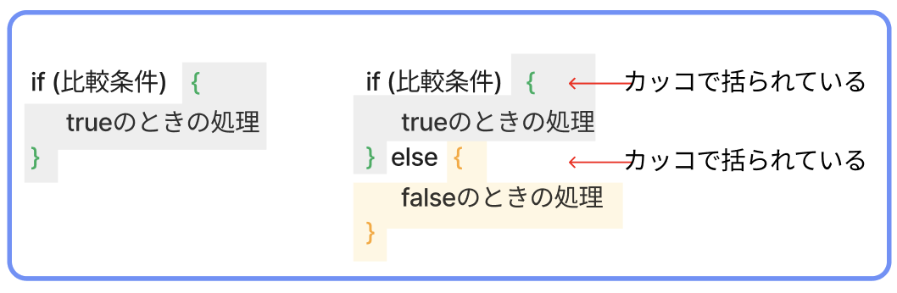
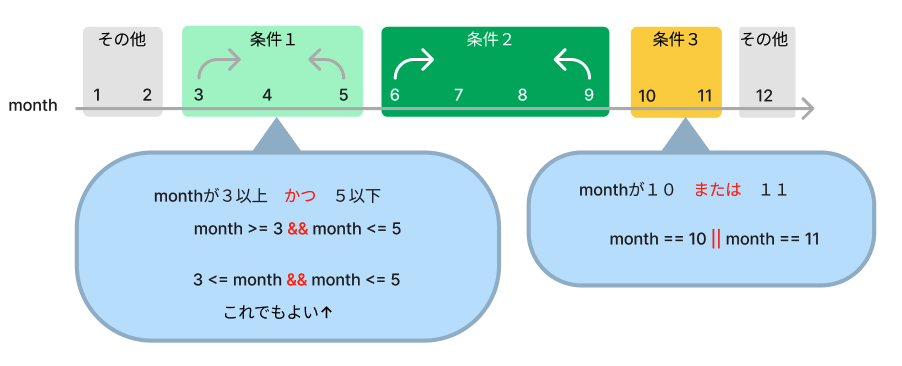

# **05_条件分岐**

`A` と `B` を比べた結果で、処理を分けること  




## **条件分岐の書き方①**

```c#
  if (比べる式 ・ 条件) { // もし〜ならば
    条件が合ってた時の処理;
  }
```

例１： A == B （変数と数値の比較）
- **自分の年齢** と **18**を比べて  

  - true：一致したら「成人おめでとう！」と出力

<br>

```c#

  var age = 18;

  if (age == 18) {
    Console.WriteLine("成人おめでとう！");
  }

```

## **条件分岐の書き方②**

```c#
  if (比べる式 ・ 条件) { // もし〜ならば
    条件が合ってた時の処理;
  } else { // その他
    条件が合ってなかった時の処理;
  }
```

例２：  A >= 数値　（変数と範囲の比較）
- **自分の年齢** が **18以上**
  - true：一致したら「成人」と出力
  - false：一致しなかったら「未成年」と出力

<br>

```c#

  var age = 18;

  if (age >= 18) {
    Console.WriteLine("成人おめでとう！");
  }else{
    Console.WriteLine("未成年です");
  }

```

## **書き方のコツ**


例３：  A == B　（変数と変数の比較）
- **今の月** と **自分の誕生日月**が
  - true：一致したら「おめでとう」と出力
  - false：一致しなかったら「こんにちは」と出力

```c#

  var now_month = 6;  // 今の月 ※ 設定しよう
  var my_birth_month = 2; // 自分の誕生日月 ※ 設定しよう

  if (now_month == my_birth_month) {
    Console.WriteLine("おめでとう");
  } else {
    Console.WriteLine("こんにちは");
  }

```

```
>> こんにちは
```

<br>

## **条件の追加**

- **今の月** と **自分の誕生日月**が
  - 一致したら「おめでとう」と出力
  - 一致はしないが、誕生日月が来月だったら「来月祝うね！」 ⇦ 追加
  - それ以外だったら「こんにちは」と出力

```c#
  if (比べる式 ・ 条件) {
    条件が合ってた時の処理;
  } else if (比べる式 ・ 条件②) { // 追加
    条件が合ってた時の処理;
  } else {
    条件が合ってなかった時の処理;
  }
```

```c#

  var now_month = 6;  // 今の月 ※ 設定しよう
  var my_birth_month = 7; // 自分の誕生日月 ※ 設定しよう

  if (now_month == my_birth_month) {
    Console.WriteLine("おめでとう");
  } else if (now_month + 1 == my_birth_month) {
    Console.WriteLine("来月祝うね！");
  } else {
    Console.WriteLine("こんにちは");
  }

```

```
>> 来月祝うね！
```

<br>

**ポイント**
- 条件の中で使う、比べるための記号を「比較演算子」という
  - `A`と`B`は同じ？
    - `A == B`
  - `A`と`B`は違う？
    - `A != B`
  - `A`は`B`より大きい？
    - `A > B`
  - `A`は`B`より小さい？
    - `A < B`
  - `A`は`B`以上？
    - `A >= B`
  - `A`は`B`以下？
    - `A <= B`
- 条件分岐を考える3ステップ
  - 「何」と「何」を比べる？
  - 合ってたらどうする？
  - 違っていたらどうする？
    - 違っていたら何もしない、の場合は`else`を省略

<br>

## **範囲を指定した条件判定**

- **3月から5月**　は「春ですね」
- **6月から9月**　は「夏ですね」
- **10月と11月**　は「秋ですね」
- **12月から2月**　は「冬ですね」

と出力するプログラムを考えます.

条件に**3月から5月**といった範囲指定をする場合




```c#

  var month = 1;
  
  if (3 <= month && month <= 5) {
    Console.WriteLine("春ですね");
  } else if (6 <= month && month <= 9) {
    Console.WriteLine("夏ですね");
  } else if (10 == month || month == 11) {
    Console.WriteLine("秋ですね");
  } else {
    Console.WriteLine("冬ですね");
  }

```

# **確認問題**

## **問題①**
続きのプログラムを書こう!! 

- **入力したパスワード** と **登録されているパスワード** が一緒の時だけ **鍵が開きました** と出力
- 違ったら何もしない

```c#

  var input_pass = 1234;  // 入力パスワード
  var entry_pass = 12345; // 登録パスワード

  //続きのプログラムを書こう

```

```
>> 鍵が開きました
```

<br>

## **問題②**
続きのプログラムを書こう!!

- １等のときは「おめでとう」と出力
- それ以外は「ざんねん」と出力

```c#

  var random = new Random();
  var number = random.Next(1, 4);
  Console.WriteLine("あなたの当選は" + number + "等です"); 
  //続きのプログラムを書こう

```

```
>> おめでとう
>> ざんねん
```

<br>

## **問題③**
問題②のプログラムを書き換えよう

- １等のときは「おめでとう」と出力
- ２等のときは「おしい！」と出力
- それ以外は「ざんねん」と出力

```c#

  var random = new Random();
  var number = random.Next(1, 4);
  Console.WriteLine("あなたの当選は" + number + "等です"); 
  //続きのプログラムを書こう

```

```
>> おめでとう
>> おしい！
>> ざんねん
```

<br>
## **問題④**
  
修正して、エラーをなくそう！

```c#
void main() {

  var random = new Random();
  var point = random.Next(1, 4) * 100;
  Console.WriteLine("あなたの得点は" + point + "点です"); 

  if(point = 300){
    Console.WriteLine("すごい！");
  }else{
    Console.WriteLine("もうすこし");
  }

}
```

<br>
## **問題⑤**
  
修正して、エラーをなくそう！

```c#
void main() {

  var random = new Random();
  var point = random.Next(1, 4) * 100;
  Console.WriteLine("あなたの得点は" + point + "点です"); 

  if(point == 300){
    Console.WriteLine("すごい！");
  }else
    Console.WriteLine("もうすこし");
  }

}

```

<br>
## **問題⑥**
  
修正して、エラーをなくそう！

```c#
void main() {

  var random = new Random();
  var point = random.Next(1, 4) * 100;
  Console.WriteLine("あなたの得点は" + point + "点です"); 

  if(point == 300){
    Console.WriteLine("すごい！");
  }elseif (100 < point && point < 300){
    Console.WriteLine("おしい");
  }else{
    Console.WriteLine("もうすこし");
  }

}

```