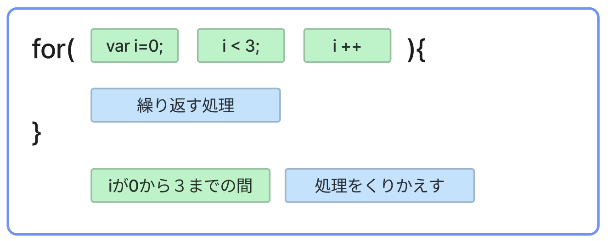

# **07_繰り返し（while文）**

同じ処理を繰り返す

例：  
「生麦生米生卵」を3回表示するプログラムを考える  

```dart
  void main() {
    Console.WriteLine("生麦生米生卵");
    Console.WriteLine("生麦生米生卵");
    Console.WriteLine("生麦生米生卵");
  }
```

printを3回書けば出力できるけど　もし100回に増えたら・・・  
繰り返し文を使って出力してみよう

<br>

## **繰り返し文の書き方**

１回２回・・・とカウントしながら繰り返します

```dart
  //①カウンタ変数初期化
  while (②条件式) {
    //繰り返す処理
    //③カウンタ変数の更新
  } 
```

```c#

  var i = 0;
  while(i < 3){
    Console.WriteLine($"{i}ー生麦生米生卵");
    i++;
  }

```

**①カウンタ変数初期化**  
カウンタ変数iの宣言と初期値を代入  
```
var i = 0;
```

**②繰り返し条件**  
  条件結果がtrueのとき {} の中の処理を実行する  
```
i < 3;
```

**③カウンタ更新処理**

- **++** は1を足すこと　インクリメントと呼ぶ
- 2を足したい場合　**i = i + 2** と書く

  変数 **i** の値が **3 より小さい間**  　{}内の処理を繰り返す

  <!--  -->

<br>

### **iの値の変化と処理の流れをみてみよう**

|  処理回数  |  iの値  |  判定(i<3)  |  表示  |  i++  |
| :----: | :----: | :----: | :----: | :----: |
|  1回目の処理  |  0  |  0<3<br>true  | 生麦生米生卵 | 1 |
|  2回目の処理  |  1  |  1<3<br>true  | 生麦生米生卵 | 2 |
|  3回目の処理  |  2  |  2<3<br>true  | 生麦生米生卵 | 3 |
|  4回目の処理  |  3  |  3<3<br>`false`  |`{}の中は実行されない`| - |

<br>

## **while文のいろいろな使い方**

<br>

### **① 10から1まで表示する**

```c#

  var count = 10;
  while(count>0){
    Console.WriteLine(count);
    count--;
  }

```

```
>> 10
>> 9
>> 8
>> 7
>> 6
>> 5
>> 4
>> 3
>> 2
>> 1
```

**ポイント**

- 「①カウンタ変数初期化」「②繰り返し条件」「③カウンタ更新処理」が逆になる
- 特に「繰り返し条件」の符号の向きに注意
- **count--** は **count** から **1** を引くこと

<br>

### **② 0から10までの`偶数`を表示する**

```c#

  var j = 0;
  while(j<=10){
    Console.WriteLine(j);
    j = j + 2;
    //これでもよいj += 2;
  }
          
```

```
>> 0
>> 2
>> 4
>> 6
>> 8
>> 10
```

**ポイント**

- 条件式の比較演算子`<=`は≦    
- **j = j + 2**の計算　**j+2** の結果を **j** に再代入する  

<br>

### **③ while文の中でif文を使う**
**0から10までの`偶数`を表示する**

```c#
  var j = 0;
  while(j<=10){
    if(j % 2==0){
      Console.WriteLine(j);
    }
    j++;
  }
```

```
>> 0
>> 2
>> 4
>> 6
>> 8
>> 10
```

**ポイント**

- **while文** の中に **if文** を入れて、ある条件のときだけ処理をする

<br>


# **確認問題**

## **問題①**

10から0まで表示するプログラムを考える  
このプログラムは繰り返し処理が終わらない「無限ループ」になります  
無限ループになる理由を考えよう  
`※注意※　このプログラムは実行しないでください！！`

```c#

var i = 10;
while(i > 0){
  Console.WriteLine(i);
  i++;
}

```

## **問題②**

while文を使って20から10まで、数値を一行ずつカウントダウン表示するプログラムを作成してください　`無限ループに注意`

```
>> 20
>> 19
>> 18
>> 17
>> 16
>> 15
>> 14
>> 13
>> 12
>> 11
>> 10
```

<br>

## **問題③**

敵と戦うプログラムを作ります

- 敵のHPは30
- 敵に続けて攻撃
- 攻撃力は1から10までランダム
- 敵のHPが０になるまで攻撃を繰り返す

出力例
```

>> 攻撃力8！敵のHPは22になった
>> 攻撃力2！敵のHPは20になった
>> 攻撃力6！敵のHPは14になった
>> 攻撃力9！敵のHPは5になった
>> 攻撃力6！敵のHPは-1になった
>> 敵を倒した

```

<br>

## **問題④**

問題③の続き、何回で敵を倒したか出力しよう

出力例
```

>> 攻撃力8！敵のHPは22になった
>> 攻撃力2！敵のHPは20になった
>> 攻撃力6！敵のHPは14になった
>> 攻撃力9！敵のHPは5になった
>> 攻撃力6！敵のHPは-1になった
>> 5回の攻撃で敵を倒した

```

# **回答**

## **問題①**

このプログラムは繰り返し処理が終わらない「無限ループ」になります  
無限ループになる理由を考えよう  

```dart
// 繰り返し条件が常にtrueになるから
// i++ → i--
```

## **問題②**

while文を使って20から10まで、数値を一行ずつカウントダウン表示するプログラムを作成してください


```c#

var i = 20;
while(i >= 10){
  Console.WriteLine(i);
  i--;
}

```

## **問題③**

敵と戦うプログラムを作ります

```c#

var random = new Random();
var hp = 30;  // カウンタ変数の初期化
var hit = 0;
while(hp >= 1) {
    hit = random.Next(1, 11);
    hp -= hit;  // カウンタ変数の更新
    Console.WriteLine($"攻撃力{hit}！敵のHPは{hp}になった");  // 繰り返し処理
}
Console.WriteLine("敵を倒した");

```

## **問題④**

```c#

var random = new Random();
var hp = 30;  // カウンタ変数の初期化
var hit = 0;
var count = 0;
while(hp >= 1) {
    hit = random.Next(1, 11);
    hp -= hit;  // カウンタ変数の更新
    Console.WriteLine($"攻撃力{hit}！敵のHPは{hp}になった");  // 繰り返し処理
    count ++;
}
Console.WriteLine($"{count}回で敵を倒した");

```
