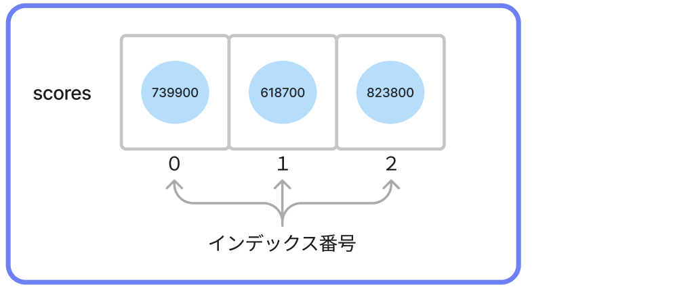

# **10_配列**

複数のデータを入れるための **†領域†** のこと  
もちろん、名前をつけることができる



<br>

## **配列を作る**

`<型>[] 名前 = {1つ目のデータ, 2つ目のデータ, ...};`

## **配列のデータを、1つ取り出す**

### **インデックス番号**

- 最新のスコアデータ(**3**番目)を取り出したい時は 
`scores[2]` と書く  
- プログラミングの世界では、数える時「0番目、1番目、2番目...」となり **0** から始まる  
- 配列の名前[**x**] の **x** に書く **-1** した番号のことを **インデックス番号** と呼ぶ

```c#
  int[] scores = {739900, 618700, 823800};
  Console.WriteLine(scores[0]);
  Console.WriteLine(scores[1]); 
  Console.WriteLine(scores[2]); 

```

```
>> 739900
>> 618700
>> 823800
```

<br>

## **配列に変数を代入**

変数の再代入と同じ方法でできる

```c#
  int scores1 = 739900;
  int scores2 = 618700;
  int scores3 = 823800;
  
  int[] scores = {scores1, scores2, scores3};
  Console.WriteLine(scores[0]);
  Console.WriteLine(scores[1]); 
  Console.WriteLine(scores[2]); 
```

```
>> 739900
>> 618700
>> 823800
```

<br>

## **文字列の配列**

```c#

  string[] animals = {"ねこ", "いぬ", "ハムスター"};
  Console.WriteLine(animals[0]);
  Console.WriteLine(animals[1]);
  Console.WriteLine(animals[2]);

```

```
>> ねこ
```

<br>

## **ループで配列を処理**

```c#

  string[] animals = {"ねこ", "いぬ", "うさぎ"};

  for(var i = 0; i<animals.Length; i++){
        Console.WriteLine(animals[i]);
  }

```

`.Length`は配列のデータ数を取得するメソッド  
データが増えても出力可能

<br>

## **ループで配列を処理２**

```c#

  string[] animals = {"ねこ", "いぬ", "ハムスター"};

  foreach (string item in animals){
     Console.WriteLine(item);
  }

```

<br>

## **空の配列を作る**

```c#

  string[] animals = new String[3];

  foreach (string item in animals){
     Console.WriteLine(item);
  }

```

空の入れ物だけ作る  
続けて、データを代入

```c#
  animals[0] = "いぬ";
  animals[1] = "ねこ";
  animals[2] = "うさぎ";
   
  foreach (string item in animals){
    Console.WriteLine(item);
  }
```

# **確認問題**

## **問題①**
プログラムを書こう!!
- カレーの材料を **3つ以上** 考えよう
- **curry** という名前の配列を作り、材料の名前を入れよう
- **2番目のデータだけ** を出力しよう
```
>> (2番目のデータ 例：じゃがいも)
```

<br>

## **問題②**

このプログラムがエラーを出す理由は何だろう？

```c#
  string[] animals = {"犬", "猫"};
  Console.WriteLine(animals[2]);
```

## **問題③**

配列のデータをfor文を使って全て出力しよう

```c#

  int[] scores = {739900, 618700, 823800};

```

## **問題④**

問題③の続き、配列内のデータの合計を出力しよう

```c#

  int[] scores = {739900, 618700, 823800};

```

## **問題⑤**

配列のデータをforeachを使って全て出力しよう

```c#

  int[] scores = {739900, 618700, 823800};

```

## **問題⑥**

問題⑤の続き、配列内のデータの合計を出力しよう

```c#

  int[] scores = {739900, 618700, 823800};

```