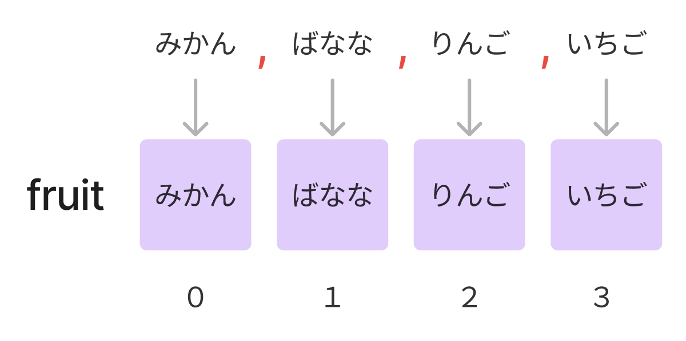

# **11_List**

複数のデータを入れるための **†領域†** のこと  

## **配列とリストの違い**  

### **配列**

- 宣言すると最初に決まったデータ数の領域ができる  
- データを追加したり、削除することができない

### **リスト**

- あとから自由に要素の追加・変更・削除ができる

<br>

## **Listクラスを使う**

プログラムの最初に記述  


<br>

```
using System.Collections.Generic;
```

### **リストを作って、データを追加**

```c#

  var sports = new List<string>();
  sports.Add("野球");
  sports.Add("サッカー");
  sports.Add("バスケ");

  foreach (string item in sports){
      Console.WriteLine(item);
  }

```

```
>> 野球
>> サッカー
>> バスケ
```

<br>

**リストを作る**

```
var [リスト名] = new List<データの型>();
```

<br>

### **データを削除**

```c#

  var sports = new List<string>();
  sports.Add("野球");
  sports.Add("サッカー");
  sports.Add("バスケ");
  sports.Remove("野球");

  foreach (string item in sports){
      Console.WriteLine(item);
  }

```

```
>> サッカー
>> バスケ
```

### **データ数を取得**

```c#

  var sports = new List<string>();
  sports.Add("野球");
  sports.Add("サッカー");
  sports.Add("バスケ");

  Console.WriteLine(sports.Count);

```

```
> 3
```

<br>

### **リストをつくる（数値）**

```c#

  var count = new List<int>();
  count.Add(1);
  count.Add(2);
  count.Add(3);

  foreach (int item in count){
      Console.WriteLine(item);
  }

```

```
> 1
> 2
> 3
```

格納するデータの型に合わせて記述する

<br>

### **文字列を分割して配列に入れる**

```c#

  var fruit = "みかん,ばなな,りんご,いちご";
  string[] array = fruit.Split(',');
  foreach (var item in array) {
    Console.WriteLine(item);
  }

```


<br>

### **文字列を分割してデータの個数をカウント**

```c#

  var fruit = "みかん,ばなな,りんご,いちご";
  int fruit_count = fruit.Split(',').Length;
  Console.WriteLine(fruit_count);

```

# **確認問題**

## **問題①**

税込価格を計算した結果をリストに追加するプログラムを考えます  
下記のプログラムのXXXXXの部分に追記しよう  

- taxlistというリストを作成
- 元の値段が入れられた配列priceからデータを1件ずつ取得
- 税込価格を計算する
- 計算した結果をリストに追加
- taxlistのデータを出力
  
```c#

    int[] price = {100,500,1000};　//元の値段の配列
    
    //①taxlistというリストを作る
    XXXXX

    //②foreachでpriceのデータを１件ずつ取得
    foreach(int item in XXXXX){
        var tax = item + (item * 0.08);
        //③taxlistにデータを追加
        XXXXX
    }

    foreach(double item in taxlist){
        Console.WriteLine(item);
    }

```

<br>

## **問題②**

英語の文章から単語を表示するプログラムを考えます
- textに代入された英文を「半角空白」で区切って配列に入れる
- 単語を出力
- 最後に単語の数を出力
  
XXXXXの部分を書き換えよう

```c#

  var text = "You have to learn to walk before you run";
    
  String[] array = XXXXX;
  foreach (var item in array) {
      Console.WriteLine(item);
  }
  
  XXXXX

```

<br>

## **解答例**

<br>

## **問題①**

```c#

    int[] price = {100,500,1000};　//元の値段の配列
    
    var taxlist = new List<double>();

    foreach(int item in price){
        var tax = item + (item * 0.08);
        taxlist.Add(tax);
    }

    foreach(double item in taxlist){
        Console.WriteLine(item);
    }

```

<br>

## **問題②**

```c#

  var text = "You have to learn to walk before you run";
    
  String[] array = text.Split(' ');
  foreach (var item in array) {
      Console.WriteLine(item);
  }
  
  Console.WriteLine(array.Length);

```

<br>
